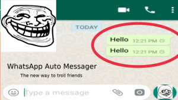

# Whatsapp Auto Messager
> Aplication to auto send messages to one of yuor contacts in Whatsapp

  The WhatsappAutoMessager uses the Selenium python library in order to interact with the web.whatsapp.com html in order to joke with some of your contacts and send the same massage as many times you want to.
  In order to send messages, the code does the analysis of the important HTML parts such as the text field and the name of the contact that appear in the GUI.




## Installation

OS X & Linux:

```sh
pip3 install selenium
sudo apt-get install firefox-geckodriver git
git clone https://github.com/Wanghley/WhatsappAutoMessager.git
cd WhatsappAutoMessager/
python3 WhatsappMessagerFucker.py
```

Windows:

```sh
coming soon...
```

## Usage example

You can use to joke a friend or to send a lot of messages to your crush in order to have attention or to send anything that you want to anyone of your Whatsapp list!

## Development setup

To development use the installation process guide!

## Release History

* 0.1.0
    * BETA app to experimental purposes only

## Meta

Wanghley Soares Martins – [@Wanghley](https://www.instagram.com/Wanghley/) – wanghleys@gmail.com

Distributed under the GPL-3.0 license. See [``LICENSE``](https://github.com/Wanghley/WhatsappAutoMessager/blob/master/LICENSE) for more information.

[https://github.com/Wanghley](https://github.com/Wanghley)

## Contributing

1. Fork it (<https://github.com/Wanghley/WhatsappAutoMessager/fork>)
2. Create your feature branch (`git checkout -b feature/fooBar`)
3. Commit your changes (`git commit -am 'Add some fooBar'`)
4. Push to the branch (`git push origin feature/fooBar`)
5. Create a new Pull Request

<!-- Markdown link & img dfn's -->
